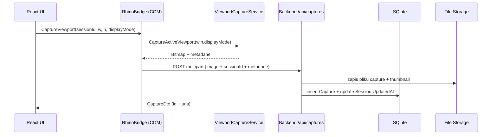
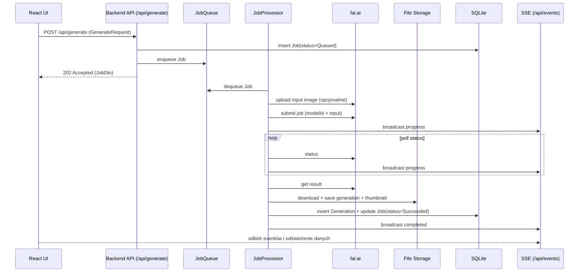

# Rhino Image Studio — Mapa Katalogów

> Repozytorium: `D:\Rhino Image Studio` (Windows)
> 
> Ten dokument opisuje **fizyczny układ katalogów** w repo oraz **przepływy** między komponentami (Plugin Rhino ↔ Backend ↔ UI ↔ fal.ai).

---

## 1) Root repo (`D:\Rhino Image Studio\`)

```
Rhino Image Studio/
├─ .editorconfig
├─ .gitignore
├─ AGENTS.md                 # protokoły agentów / zasady pracy
├─ README.md                 # instrukcja build/run (dev)
├─ SPEC.md                   # spec produktu + docelowa architektura
├─ _journal/                 # logi pracy agentów (Markdown + assets)
├─ build/                    # artefakty builda (Debug/…)
├─ obj/                      # artefakty pośrednie MSBuild
└─ src/                      # cały kod (solution + projekty)
```

### `_journal/`
- pliki typu: `_journal/2026-01-13-sisyphus.md`, `_journal/2026-01-13-frontend-ui-ux-engineer.md`
- mogą pojawić się assety (np. `_journal/instrukcja.jpg`)

### `build/`
Artefakty wynikowe kompilacji (nie źródła). W praktyce w `build/Debug/` znajdują się różne targety:
- `build/Debug/net48/` — plugin Rhino (`RhinoImageStudio.rhp`) + zależności
- `build/Debug/net8.0-windows/` — backend (`RhinoImageStudio.Backend.exe/.dll`) + zależności
- dodatkowo: `net7.0`, `net8.0`, `net48-new`, `net7.0-windows` (historyczne/eksperymentalne outputy)

---

## 2) `src/` — kod źródłowy

```
src/
├─ Directory.Build.props
├─ RhinoImageStudio.sln
├─ RhinoImageStudio.Plugin/      # Plugin Rhino (net48)
├─ RhinoImageStudio.Backend/     # ASP.NET Core Backend (net8.0-windows)
├─ RhinoImageStudio.Shared/      # Wspólne modele/kontrakty (net48;net8.0)
└─ RhinoImageStudio.UI/          # React UI (Vite + TS + Tailwind)
```

### 2.1) `src/RhinoImageStudio.Plugin/` (Plugin Rhino)

Cel: host panelu w Rhino + WebView2 + integracja RhinoCommon + uruchamianie backendu.

```
RhinoImageStudio.Plugin/
├─ RhinoImageStudio.Plugin.csproj
├─ RhinoImageStudioPlugIn.cs     # entry pluginu, rejestr panelu
├─ ImageStudioPanel.cs           # dock panel (Eto) + WebView2 host
├─ BackendManager.cs             # start/stop backend sidecar + healthcheck
├─ RhinoBridge.cs                # COM host object dla JS (wywołania Rhino + upload capture)
├─ ViewportCaptureService.cs     # capture viewportu (Rhino.Display.ViewCapture)
├─ Commands/
│  └─ Commands.cs                # komendy Rhino (ImageStudio, ShowImageStudio, ImageStudioCapture)
└─ Polyfills/
   └─ CompilerPolyfills.cs       # wsparcie kompilacji / kompatybilność
```

### 2.2) `src/RhinoImageStudio.Backend/` (Backend ASP.NET Core)

Cel: lokalne API + SQLite + storage plików + queue jobów + fal.ai proxy + SSE.

```
RhinoImageStudio.Backend/
├─ RhinoImageStudio.Backend.csproj
├─ Program.cs                    # minimal API + DI + endpointy + SSE
├─ Data/
│  └─ AppDbContext.cs            # EF Core model + SQLite
├─ Services/
│  ├─ FalAiClient.cs             # upload/submit/status/result/cancel do fal.ai
│  ├─ JobQueue.cs                # kolejka (Channel)
│  ├─ JobProcessor.cs            # BackgroundService wykonujący joby
│  ├─ EventBroadcaster.cs        # broadcast progress przez SSE
│  ├─ StorageService.cs          # file storage (captures/generations/thumbs/exports)
│  └─ SecretStorage.cs           # DPAPI (klucz fal.ai) per user
└─ wwwroot/                      # statyczne pliki UI serwowane przez backend
   ├─ index.html
   └─ assets/
      ├─ index-*.js
      └─ index-*.css
```

> Uwaga: backend **już ma** `wwwroot/` z buildem frontendu (Vite output). W samym projekcie UI katalog `dist/` może nie istnieć w repo w danym momencie, bo jest generowany w buildzie.

### 2.3) `src/RhinoImageStudio.Shared/` (Shared contracts/models)

Cel: wspólne typy dla pluginu i backendu (DTO, encje, enumy, stałe).

```
RhinoImageStudio.Shared/
├─ RhinoImageStudio.Shared.csproj
├─ Constants/
│  └─ Constants.cs               # Routes, FalModels, StoragePaths, Defaults (np. port 17532)
├─ Contracts/
│  └─ Contracts.cs               # request/response DTO (sessions/captures/generate/jobs/config/export)
├─ Enums/
│  └─ Enums.cs                   # enumy (JobType, JobStatus, DisplayMode, itp.)
├─ Models/
│  └─ Models.cs                  # encje EF (Session, Capture, Generation, Job)
└─ Polyfills/
   └─ IsExternalInit.cs          # wsparcie rekordów/kompilacji dla starszych TFMs
```

### 2.4) `src/RhinoImageStudio.UI/` (Frontend React)

Cel: SPA (React) hostowana w Rhino przez WebView2, serwowana przez backend.

```
RhinoImageStudio.UI/
├─ index.html
├─ package.json
├─ package-lock.json
├─ vite.config.ts
├─ tailwind.config.js
├─ postcss.config.js
├─ tsconfig.json
├─ tsconfig.node.json
└─ src/
   ├─ main.tsx                   # bootstrap React
   ├─ App.tsx                    # router (Home + Studio)
   ├─ index.css                  # globalne style (Tailwind)
   ├─ pages/
   │  ├─ HomePage.tsx            # lista sesji
   │  └─ StudioPage.tsx          # główny ekran (Sources/Canvas/Controls/Timeline)
   ├─ components/
   │  ├─ Common/                 # Button, Input, Modal, Slider, …
   │  ├─ Controls/               # CaptureSettings, PromptInput, MultiAngleSettings, …
   │  ├─ Sessions/               # SessionCard, CreateSessionModal
   │  ├─ Studio/                 # SourcesPanel, CanvasPanel, ControlsPanel, TimelinePanel
   │  └─ Layout/                 # (folder istnieje; elementy zależnie od rozwoju)
   ├─ hooks/
   │  ├─ useRhino.ts             # wykrycie i użycie RhinoBridge
   │  ├─ useJobs.ts              # subskrypcja jobów (SSE)
   │  └─ useSession.ts           # logika sesji (stan/ładowanie)
   └─ lib/
      ├─ api.ts                  # fetch wrapper do `/api/*`
      ├─ rhino.ts                # dostęp do `window.chrome.webview.hostObjects.rhino`
      ├─ sse.ts                  # klient SSE
      ├─ types.ts                # typy UI
      └─ utils.ts
```

---

## 3) Katalogi runtime (poza repo) — gdzie trafiają dane użytkownika

To nie są katalogi w repo, tylko na maszynie użytkownika (Windows):

- **SQLite DB**:
  - `%LocalAppData%\RhinoImageStudio\rhinoimagestudio.db`
- **File storage (obrazy)**:
  - `%LocalAppData%\RhinoImageStudio\data\`
    - `captures/` (wejściowe zrzuty)
    - `generations/` (wyniki)
    - `thumbnails/` (miniatury)
    - `exports/` (eksport)
    - `temp/`
- **Sekrety (fal.ai key, DPAPI)**:
  - `%LocalAppData%\RhinoImageStudio\secrets\`
- **Dane WebView2 (cache/profil)**:
  - `%LocalAppData%\RhinoImageStudio\WebView2\`

---

## 4) Diagramy przepływu

### 4.1) Architektura procesów i komunikacji (wysoki poziom)

```mermaid
flowchart LR
  subgraph RhinoProcess[Proces Rhino]
    Plugin[RhinoImageStudio.Plugin (net48)]
    WebView[WebView2 hostowany w panelu Eto/WPF]
    Bridge[RhinoBridge (COM Host Object)]
  end

  subgraph BackendProcess[Proces Backend]
    API[ASP.NET Core API (localhost)]
    Queue[JobQueue + JobProcessor]
    DB[(SQLite)]
    FS[(File Storage)]
    Secrets[(DPAPI Secrets)]
  end

  Fal[fal.ai (storage + queue)]

  WebUI[React SPA]

  Plugin -->|start/healthcheck| API
  WebView --> WebUI

  WebUI -->|HTTP /api/*| API
  WebUI -->|JS Host Object calls| Bridge

  Bridge -->|multipart upload capture| API

  API --> DB
  API --> FS
  API --> Secrets

  Queue -->|submit/status/result| Fal
  Fal -->|result urls| Queue

  API -->|SSE /api/events| WebUI
```

### 4.2) Capture viewportu (Rhino → Backend → DB/Storage)



### 4.3) Generacja (UI → Backend job → fal.ai → zapis wyniku)



---

## 5) „Jak czytać” ten codebase (praktycznie)

- Jeśli szukasz **integracji z Rhino**: `src/RhinoImageStudio.Plugin/*` (szczególnie `ImageStudioPanel.cs`, `RhinoBridge.cs`, `ViewportCaptureService.cs`).
- Jeśli szukasz **API i jobów**: `src/RhinoImageStudio.Backend/Program.cs` + `Services/JobProcessor.cs`.
- Jeśli szukasz **kontraktów (request/response)**: `src/RhinoImageStudio.Shared/Contracts/Contracts.cs`.
- Jeśli szukasz **modeli danych i relacji**: `src/RhinoImageStudio.Shared/Models/Models.cs` + `Backend/Data/AppDbContext.cs`.
- Jeśli szukasz **UI i ekranów**: `src/RhinoImageStudio.UI/src/pages/*` + komponenty w `src/components/*`.

---

## 6) Szybki indeks kluczowych plików

- Plugin:
  - `RhinoImageStudioPlugIn.cs` — init pluginu i rejestr panelu
  - `ImageStudioPanel.cs` — WebView2 + ładowanie UI z backendu
  - `BackendManager.cs` — start/stop backend
  - `RhinoBridge.cs` — API dostępne w JS
  - `ViewportCaptureService.cs` — capture viewportu

- Backend:
  - `Program.cs` — endpointy i konfiguracja
  - `Services/JobProcessor.cs` — pipeline Generate/Refine/MultiAngle/Upscale
  - `Services/FalAiClient.cs` — integracja z fal.ai
  - `Services/StorageService.cs` — pliki
  - `Services/SecretStorage.cs` — DPAPI

- UI:
  - `pages/HomePage.tsx` — sesje
  - `pages/StudioPage.tsx` — studio
  - `lib/api.ts` — HTTP do backend
  - `lib/rhino.ts` + `hooks/useRhino.ts` — integracja z RhinoBridge
  - `lib/sse.ts` + `hooks/useJobs.ts` — SSE
