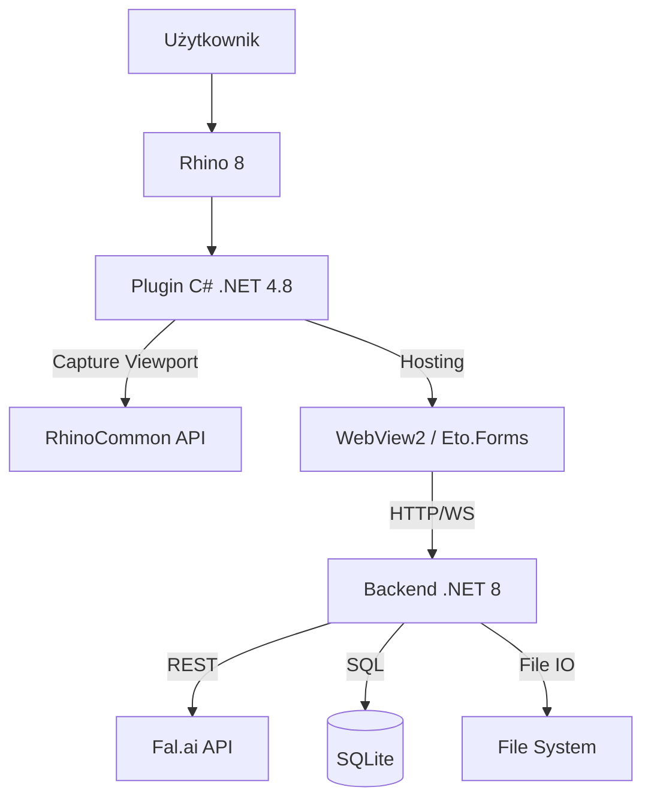

# Architektura Systemu

Rhino Image Studio to system hybrydowy łączący środowisko desktopowe CAD (.NET Framework) z nowoczesnym stosem webowym (.NET Core + React).

## Diagram Komponentów



## Opis Komponentów

### 1. Plugin Rhino (`src/RhinoImageStudio.Plugin`)
- **Technologia**: .NET Framework 4.8 (wymóg Rhino 8).
- **Zadania**:
  - Rejestracja komend (`RhinoImageStudio`).
  - Tworzenie panelu dokowanego.
  - Przechwytywanie obrazu z viewportu (`ViewCapture`).
  - Zarządzanie procesem backendu (start/stop - *planowane*).

### 2. Backend (`src/RhinoImageStudio.Backend`)
- **Technologia**: ASP.NET Core 8.0.
- **Rola**: "Mózg" operacji niezależny od Rhino.
- **Zadania**:
  - Serwowanie plików statycznych UI (React).
  - Proxy do API fal.ai (ukrywanie klucza API).
  - Kolejkowanie zadań (Jobs).
  - Baza danych (Entity Framework + SQLite) - historia sesji, promptów.

### 3. Frontend UI (`src/RhinoImageStudio.UI`)
- **Technologia**: React 18, Vite, Tailwind CSS.
- **Czcionka**: Sawarabi Gothic (Google Fonts).
- **Zadania**:
  - Interfejs użytkownika.
  - Wizualizacja postępu.
  - Edytory parametrów.

## Design System

### Paleta Kolorów

Aplikacja używa custom blue-gray palety z pełnym wsparciem Light/Dark mode.

| Token | Light Mode | Dark Mode | Użycie |
|-------|------------|-----------|--------|
| `text` | `#4b5563` | `#9ca6b4` | Główny tekst |
| `background` | `#f3f4f6` | `#090a0c` | Tło aplikacji |
| `primary` | `#1f2937` | `#c8d2e0` | Nagłówki, CTA |
| `secondary` | `#48566a` | `#95a3b7` | Tekst drugorzędny |
| `accent` | `#9ca4b0` | `#4f5763` | Stonowane akcenty |
| `panel-bg` | `#ffffff` | `#0f1115` | Panele boczne |
| `card-bg` | `#f9fafb` | `#161a1f` | Karty, overlay |
| `border` | `#e5e7eb` | `#252a31` | Obramowania |

### Typografia

**Czcionka:** Sawarabi Gothic

| Rozmiar | Wartość |
|---------|---------|
| `sm` | 0.750rem |
| `base` | 1rem |
| `xl` | 1.333rem |
| `2xl` | 1.777rem |
| `3xl` | 2.369rem |
| `4xl` | 3.158rem |

### Użycie w kodzie

```tsx
// Tailwind classes
<div className="bg-background text-primary border-border">
<button className="bg-primary text-background hover:bg-primary/90">
  CTA Button
</button>
```

Pełna specyfikacja w `CLAUDE.md` sekcja 6.

## Przepływ Danych (Data Flow)

1. **Capture**: Plugin przechwytuje bitmapę -> wysyła POST do Backendu.
2. **Job**: Backend tworzy zadanie, zapisuje obraz na dysku, dodaje wpis do DB.
3. **Generate**: Backend wysyła request do fal.ai. Frontend odpytuje (lub dostaje SSE) o status.
4. **Result**: Fal.ai zwraca URL obrazu -> Backend go pobiera i zapisuje lokalnie -> Frontend wyświetla.

## Struktura Bazy Danych

Główne encje:
- **Session**: Kontener na pracę użytkownika.
- **Generation**: Pojedyncza operacja (Prompt + Parametry).
- **Asset**: Plik fizyczny (obraz wejściowy, wynikowy).
