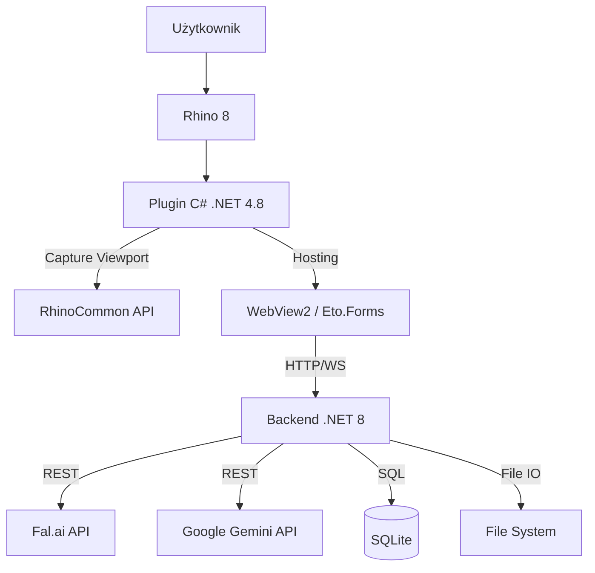

# Architektura Systemu

Rhino Image Studio to system hybrydowy łączący środowisko desktopowe CAD (.NET Framework) z nowoczesnym stosem webowym (.NET Core + React).

## Diagram Komponentów



## Opis Komponentów

### 1. Plugin Rhino (`src/RhinoImageStudio.Plugin`)
- **Technologia**: .NET Framework 4.8 (wymóg Rhino 8).
- **Zadania**:
  - Rejestracja komend (`RhinoImageStudio`).
  - Tworzenie panelu dokowanego.
  - Przechwytywanie obrazu z viewportu (`ViewCapture`).
  - Zarządzanie procesem backendu (start/stop - *planowane*).

### 2. Backend (`src/RhinoImageStudio.Backend`)
- **Technologia**: ASP.NET Core 8.0.
- **Rola**: "Mózg" operacji niezależny od Rhino.
- **Zadania**:
  - Serwowanie plików statycznych UI (React).
  - Proxy do API fal.ai (ukrywanie klucza API).
  - Kolejkowanie zadań (Jobs).
  - Baza danych (Entity Framework + SQLite) - historia sesji, promptów.

### 3. Frontend UI (`src/RhinoImageStudio.UI`)
- **Technologia**: React 18, Vite, Tailwind CSS.
- **Czcionka**: Inter (Google Fonts).
- **Zadania**:
  - Interfejs użytkownika.
  - Wizualizacja postępu.
  - Edytory parametrów.

## Design System

### Paleta Kolorów

Aplikacja używa ciepłej palety bronze-teal-navy z pełnym wsparciem Light/Dark mode.

| Token | Light Mode | Dark Mode | Użycie |
|-------|------------|-----------|--------|
| `text` | `#282828` | `#d1d1d1` | Główny tekst |
| `background` | `#ededed` | `#34312c` | Tło aplikacji |
| `primary` | `#9e683c` | `#c28b62` | Nagłówki, CTA (Bronze) |
| `secondary` | `#90a3a9` | `#586b71` | Tekst drugorzędny |
| `accent` | `#1f2f3c` | `#c3d3e0` | Akcenty (Navy / Pale Blue) |
| `panel-bg` | `#f5f5f5` | `#2b2925` | Panele boczne |
| `card-bg` | `#f9f9f9` | `#3b3834` | Karty, overlay |
| `border` | `#d8d8d8` | `#4a4740` | Obramowania |
| `danger` | `#774b4a` | `#774b4a` | Destrukcyjne akcje |

### Typografia

**Czcionka:** Inter

| Rozmiar | Wartość |
|---------|---------|
| `sm` | 0.750rem |
| `base` | 1rem |
| `xl` | 1.333rem |
| `2xl` | 1.777rem |
| `3xl` | 2.369rem |
| `4xl` | 3.158rem |

### Użycie w kodzie

```tsx
// Tailwind classes
<div className="bg-background text-primary border-border">
<button className="bg-primary text-background hover:bg-primary/90">
  CTA Button
</button>
```

Pełna specyfikacja w `CLAUDE.md` sekcja 6.

## Konfiguracja Modeli AI

Każdy model AI ma własną konfigurację dostępnych opcji. System jest **model-aware** - UI automatycznie dostosowuje dostępne opcje do wybranego modelu.

### Struktura konfiguracji (`models.ts`)

```typescript
interface ModelInfo {
  id: string;
  aspectRatios?: AspectRatioOption[];  // Dostępne proporcje obrazu
  resolutions?: ResolutionOption[];     // Dostępne rozdzielczości
  maxReferences?: number;              // Max obrazów referencyjnych
}
```

### Dostępne Modele

| Model | Provider | Rozdzielczości | Referencje | Domyślny dla |
|-------|----------|---------------|------------|-------------|
| **Gemini 2.5 Flash** | Gemini | 1K (1024px) | Max 4 | Generate, Refine |
| **Gemini 3 Pro** | Gemini | 1K, 2K, 4K | Max 4 | - |
| **Qwen Multi-Angle** | fal.ai | - | - | Multi-angle |
| **Topaz Upscale** | fal.ai | - | - | Upscale |

Oba modele Gemini obsługują te same aspect ratios: `1:1, 2:3, 3:2, 3:4, 4:3, 4:5, 5:4, 9:16, 16:9, 21:9`.

**Gemini 2.5 Flash** jest domyślnym modelem (tańszy, szybszy). Obsługuje tylko rozdzielczość 1K.
**Gemini 3 Pro** wspiera wyższe rozdzielczości (2K, 4K) i parametr `imageSize` w API.

> **Uwaga:** Backend (`GeminiClient.cs`) warunkuje parametr `imageSize` - wysyłany tylko dla modeli Pro. Flash nie wspiera tego parametru.

### Reference Images

Oba modele Gemini obsługują **obrazy referencyjne** — dodatkowe obrazy uploadowane z dysku, które model AI wykorzystuje jako kontekst wizualny (np. materiały, obiekty, styl).

- Upload: `POST /api/projects/{projectId}/references` (multipart, max 10MB/plik)
- Lista: `GET /api/projects/{projectId}/references`
- Usuwanie: `DELETE /api/references/{id}`
- Limit: max 4 referencje per projekt (walidacja frontend + backend)
- Przekazywanie: jako `inline_data` parts[] w Gemini API request
- UI: panel pod canvasem z miniaturkami, widoczny tylko dla modeli wspierających referencje

### Viewport Capture Synchronizacja

Capture automatycznie używa wymiarów zgodnych z wybranymi ustawieniami w edytorze:
- `InspectorPanel` → ustawienia AR/Resolution → `StudioPage` → `handleCapture()`
- Funkcja `calculateDimensions()` przelicza piksele na podstawie AR i Resolution

## Przepływ Danych (Data Flow)

1. **Capture**: Plugin przechwytuje bitmapę (wymiary z AR/Resolution) -> wysyła POST do Backendu.
2. **Job**: Backend tworzy zadanie, zapisuje obraz na dysku, dodaje wpis do DB.
3. **Generate**: Backend wysyła request do fal.ai/Gemini. Frontend odpytuje (lub dostaje SSE) o status.
4. **Result**: API zwraca URL obrazu -> Backend go pobiera i zapisuje lokalnie -> Frontend wyświetla.

## Struktura Bazy Danych

Główne encje:
- **Project**: Kontener na pracę użytkownika.
- **Capture**: Przechwycony obraz z viewportu Rhino.
- **Generation**: Pojedyncza operacja AI (Prompt + Parametry + Wynik). Pola `IsArchived` (bool) i `ArchivedAt` (DateTime?) obsługują soft-delete.
- **ReferenceImage**: Obraz referencyjny uploadowany przez użytkownika (max 4/projekt).
- **Job**: Zadanie w kolejce przetwarzania (Generate, Refine, MultiAngle, Upscale).

### Archiwizacja generacji

Generacje obsługują soft-delete (archiwizację) — nie są trwale usuwane, a oznaczane flagą `IsArchived = true`. Endpointy list generacji automatycznie filtrują zarchiwizowane wpisy. Trwałe usunięcie (z plikami) wymaga wcześniejszej archiwizacji.

Indeks kompozytowy `(ProjectId, IsArchived)` optymalizuje zapytania filtrowań.

### Endpointy archiwizacji

| Endpoint | Metoda | Opis |
|----------|--------|------|
| `DELETE /api/generations/{id}` | Soft-delete | IsArchived=true, ArchivedAt=now |
| `PUT /api/generations/{id}/restore` | Przywróć | IsArchived=false, ArchivedAt=null |
| `DELETE /api/generations/{id}/permanent` | Hard-delete | Wymaga archived, usuwa pliki + rekord |
| `GET /api/projects/{id}/generations/archived` | Lista | Tylko zarchiwizowane, sortowane po ArchivedAt |
