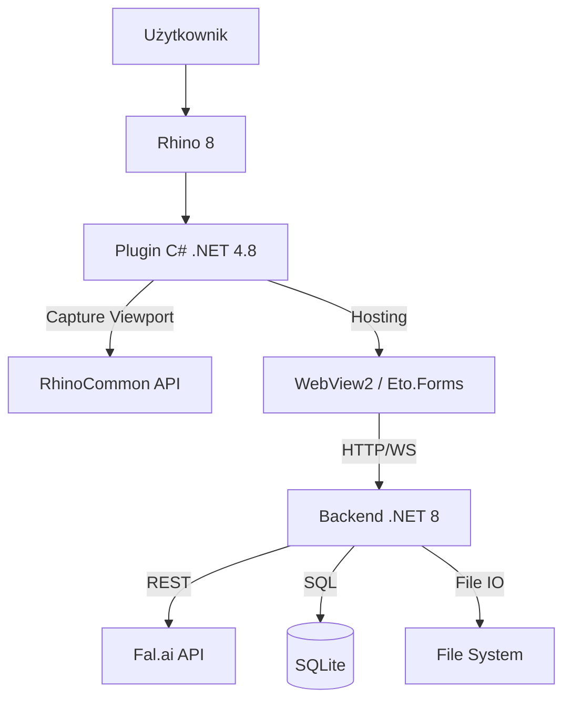

# Architektura Systemu

Rhino Image Studio to system hybrydowy łączący środowisko desktopowe CAD (.NET Framework) z nowoczesnym stosem webowym (.NET Core + React).

## Diagram Komponentów

## Opis Komponentów

### 1. Plugin Rhino (`src/RhinoImageStudio.Plugin`)
- **Technologia**: .NET Framework 4.8 (wymóg Rhino 8).
- **Zadania**:
  - Rejestracja komend (`RhinoImageStudio`).
  - Tworzenie panelu dokowanego.
  - Przechwytywanie obrazu z viewportu (`ViewCapture`).
  - Zarządzanie procesem backendu (start/stop - *planowane*).

### 2. Backend (`src/RhinoImageStudio.Backend`)
- **Technologia**: ASP.NET Core 8.0.
- **Rola**: "Mózg" operacji niezależny od Rhino.
- **Zadania**:
  - Serwowanie plików statycznych UI (React).
  - Proxy do API fal.ai (ukrywanie klucza API).
  - Kolejkowanie zadań (Jobs).
  - Baza danych (Entity Framework + SQLite) - historia sesji, promptów.

### 3. Frontend UI (`src/RhinoImageStudio.UI`)
- **Technologia**: React, Vite, Tailwind CSS.
- **Zadania**:
  - Interfejs użytkownika.
  - Wizualizacja postępu.
  - Edytory parametrów.

## Przepływ Danych (Data Flow)

1. **Capture**: Plugin przechwytuje bitmapę -> wysyła POST do Backendu.
2. **Job**: Backend tworzy zadanie, zapisuje obraz na dysku, dodaje wpis do DB.
3. **Generate**: Backend wysyła request do fal.ai. Frontend odpytuje (lub dostaje SSE) o status.
4. **Result**: Fal.ai zwraca URL obrazu -> Backend go pobiera i zapisuje lokalnie -> Frontend wyświetla.

## Struktura Bazy Danych

Główne encje:
- **Session**: Kontener na pracę użytkownika.
- **Generation**: Pojedyncza operacja (Prompt + Parametry).
- **Asset**: Plik fizyczny (obraz wejściowy, wynikowy).
